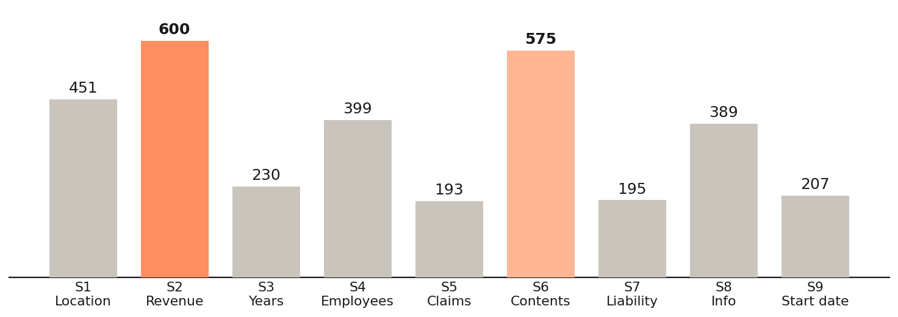
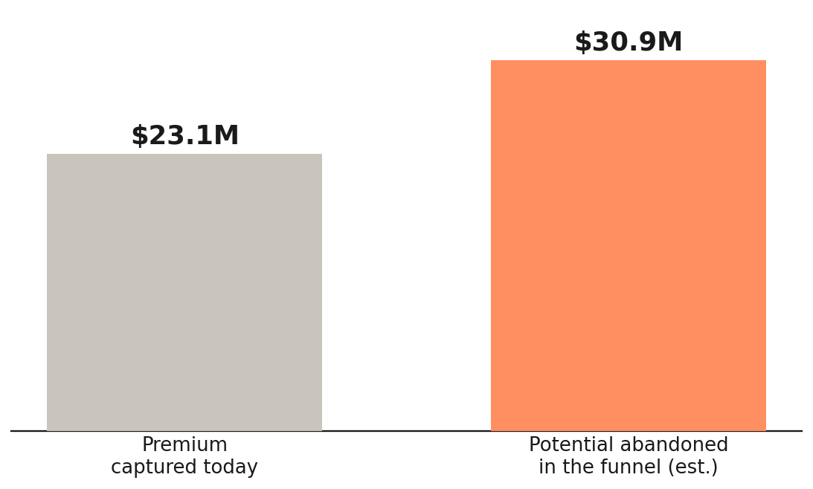

# The Revenue Question — Supernova Quote Funnel Analysis

A funnel analysis of a small-business **insurance quote flow**, built during the
Supernova BIA Externship (TripleTen, June 2026). It answers the question every
digital insurer eventually asks: *why do 1 in 3 applicants quit before they ever
see a price — and what is that leak worth?*

The headline finding: **one question does the most damage.** The Annual Revenue
question is both the biggest friction point in the form *and* the eligibility
gate — and asking it to do both jobs at once costs more potential premium than
the entire book captures today.

📊 **Final deliverable:** [`presentation/The_Revenue_Question_Supernova_Final.pptx`](presentation/The_Revenue_Question_Supernova_Final.pptx)

---

## The Business Question

Supernova sells small-business insurance through a nine-stage online quote form.
Every abandoned form is premium that walks away silently — no decline letter, no
signal, just a session that ends. The question isn't *"how many people finish?"*
— it's *"which stage kills the most quotes, why, and what would recovering it be
worth?"* This analysis walks the funnel stage by stage to tell friction problems
apart from eligibility problems and technical failures — because each one has a
different fix.

---

## Dataset

**9,817 insurance quote attempts**, one row per quote, provided by the externship
program. Each record carries the stage where an incomplete quote stopped
(`incomplete_stage`), the source app, state, industry code and category, and a
per-coverage premium breakdown (Building, Contents, Flood, Earthquake, Crime,
General Liability, Business Interruption, EBI, and more).

The analysis was staged across four Excel workbooks, each with an
`original data` → `clean data` pipeline plus pivot tables:

| File | Contents |
|------|----------|
| `data/topic1_premium_analysis.xlsx` | Data cleaning + premium breakdown by category, industry, and source app (Q1–40) |
| `data/topic2_rejections_fus.xlsx` | Rejection rates by category and FUS grade distribution (Q41–80) |
| `data/topic3_funnel_dropoff.xlsx` | Stage-by-stage funnel drop-off analysis (Q81–120) |
| `data/finals_revenue_leak.xlsx` | Final EDA — sizing the revenue leak behind the presentation |

---

## The Funnel

Nine stages, in order: **S1 Location → S2 Revenue → S3 Years in business →
S4 Employees → S5 Claims history → S6 Contents → S7 Liability → S8 Info →
S9 Start date.** Only 67% of attempts (6,578) survive all nine and reach a
final price; 3,239 quotes (33%) abandon somewhere along the way.

---

## Key Findings

- **The Annual Revenue question (S2) is the single biggest leak** — 600 applicants
  quit there, more than at any other stage. It is the first sensitive money
  question in the form, and it arrives at stage two of nine.
- **The same question is also the eligibility gate.** Supernova declines firms
  over $2M in revenue — but only at the very end, so **about 35% of everyone who
  completes the form is then rejected for being too big.** Reducing friction
  means asking revenue later; filtering ineligible firms means asking it first.
  One question cannot do both.
- **Even finishing isn't safety:** about **1,000 completed quotes generate $0
  premium** — an estimated **$10.4M in pipeline** that finishes the form but is
  never priced. Most have no verified address or map link — an address-lookup
  failure, not an underwriting decline. The form completes; pricing never runs.
- **The leak is bigger than the book.** An estimated **$30.9M of potential
  premium is abandoned in the funnel** versus the **$23.1M captured today** —
  which makes the funnel the single biggest lever in the data.

---

## Visuals

### Drop-offs by Funnel Stage

### Premium Captured vs Abandoned in the Funnel

---

## Recommendations

1. **Split the revenue question.** Add a quick eligibility gate up front to
   filter the >$2M firms early; keep the detailed revenue question where rating
   actually needs it.
2. **Fix the address lookup.** Require a verified address (Place ID) at Stage 1
   so pricing always runs — recovering the $10.4M in completed-but-unpriced
   quotes.
3. **Re-test and measure.** A/B the new flow; track completion rate and
   priced-quote rate before rollout.

---

## Notes

- **Tools:** Excel (data cleaning, pivot tables, funnel analysis), PowerPoint.
- The analysis worked through 120 structured business questions across the four
  workbooks, each answered with a pivot table and a "why it matters" note.
- The dataset was provided by the externship program for training purposes and
  reflects a simulated/anonymized book of business, not live production data.
